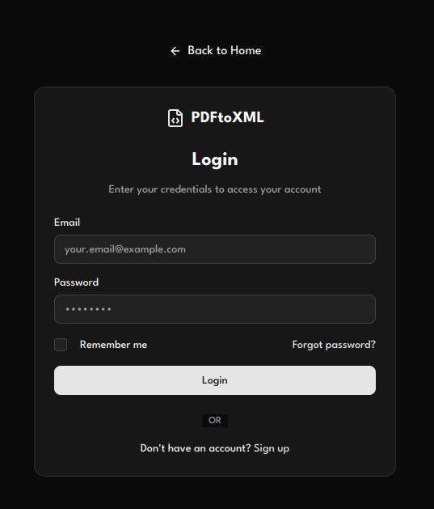
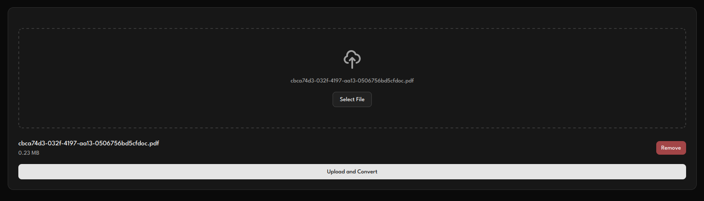
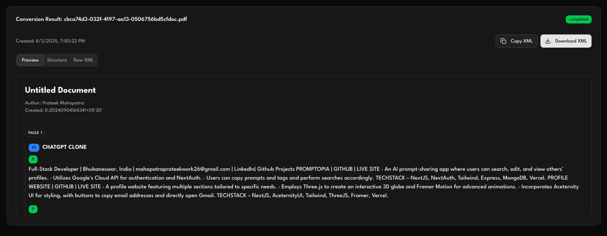
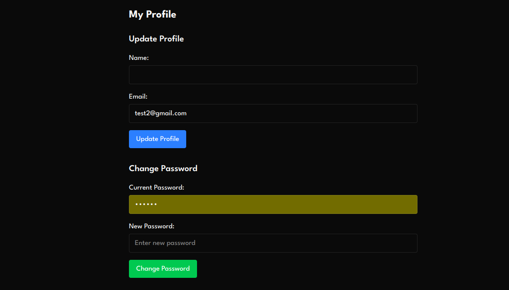

# PDF-to-XML Converter Web Application

## Important:
While visiting the live link for the first time, whether user wants to **signup or login** then he/she has to **wait max 50sec** as Free Web Service instance types will spin down after 15 minutes of inactivity and spin back up with a subsequent request - which can take a little time. This is noted in the docs: https://docs.render.com/free#spinning-down-on-idle

## Overview
This project is a **PDF-to-XML Converter Web Application** built using **Next.js, TypeScript, Prisma, PostgreSQL, and Supabase**. The application supports **user authentication, file uploads, PDF parsing, XML conversion, and result storage**. It meets all core requirements and includes Level 1 and Level 2 features as outlined in the assignment.

### **1. Code Quality & Best Practices**
- The project follows modern development practices using **TypeScript and Next.js app directory structure**.
- Utilizes **Prisma ORM** for database interactions with **PostgreSQL (via Supabase)**.
- Uses **JWT authentication with bcrypt** for user security.
- Implements **structured, modular, and reusable components** for maintainability.

### **2. Functionality & Core Features**
- **User Authentication** (JWT-based signup/login with bcrypt encryption)
- **File Upload System** (Handling PDF uploads securely)
- **PDF Parsing & XML Conversion** (Using pdf-lib to extract and transform data)
- **Data Storage & Management** (Converted XML is stored in PostgreSQL via Prisma & Supabase)
- **Result Management** (Users can view past conversions and download XML files)

### **3. Performance & Optimization**
- Uses **Next.js API routes** for efficient server-side processing.

### **4. User Interface & Experience**
- Built with **ShadCN components** for a modern UI/UX.
- Implemented **responsive design** for optimal usability across devices.
- Features a **dashboard with interactive charts (ShadCN Charts) for analytics**.

### **5. Deployment & DevOps**
- Deployed on **Vercel and Render** for frontend and backend management.
- Also Deployed on **AWS EC2 with PM2** for process management.
- Uses **Supabase for database hosting**.
- Configured **environment variables for secure deployment**.

## Assumptions & Limitations

- The application currently **only supports single-page PDFs**. If a multi-page PDF is uploaded, the system will only retrieve the total number of pages without parsing the content beyond the first page.
- The maximum allowed file size for uploads is **10MB**. Larger files will be rejected to maintain performance and prevent excessive resource usage.

## Future Improvements

To enhance the user experience and application functionality, the following improvements are planned:

1. **Adding Toast Notifications** for better user feedback and improved UX.
2. **Implementing Progress Indicators** to show file upload and conversion status.
3. **Setting Up a CI/CD Pipeline** for automated deployment and testing.
4. **Enhancing Accessibility Features** to improve usability for a diverse range of users.

### Application Screenshots

- Login Page

- File Upload Section

- Converted XML Display

- User Profile



## Local Setup Guide

### Prerequisites
Ensure you have the following installed:
- **Node.js (>=20.x.x)**
- **PostgreSQL** (or use Supabase)
- **Git**

### Steps to Run Locally

1. **Clone the Repository**
   ```sh
   git clone <repository-url>
   cd <repository-folder>
   ```

2. **Install Dependencies**
   ```sh
   npm install
   ```

3. **Set Up Environment Variables**
   Create a `.env` file in the root directory and add:
   ```sh
   DATABASE_URL=<your_supabase_postgres_url>
   JWT_SECRET=<your_secret_key>
   PORT=<PORT>
   ```

4. **Run Database Migrations**
   ```sh
   npx prisma migrate dev --name init
   ```

5. **Start the Development Server**
   ```sh
   npm run dev
   ```
   The application will be available at `http://localhost:3000`.

## Approach to PDF-to-XML Conversion

The application uses **pdf-parse** to extract text and metadata from uploaded PDF files. The extracted content undergoes a structured transformation into XML format, following these steps:

1. **Extracting Text & Metadata**
   - The system reads the PDF and extracts its text, title, author, and creation date.
   - Page count is also retrieved for structured parsing.

2. **Splitting Content into Pages**
   - The extracted text is divided into pages based on the total number of pages.
   - Each page's text is processed separately to maintain document structure.

3. **Identifying Document Sections**
   - Headers are detected using uppercase patterns.
   - Lists are recognized based on bullet points or numbering.
   - Paragraphs are formed from continuous text sections.

4. **Generating XML Structure**
   - Metadata is stored in an XML `<metadata>` section.
   - Each page is represented by a `<page>` tag with nested `<header>`, `<paragraph>`, or `<list>` elements.
   - Lists contain multiple `<item>` elements.

5. **Final XML Serialization**
   - The structured data is converted into XML format using **xmldom**.
   - The final XML document is returned and stored in the database for user access.

## Deployment

For production deployment on **AWS EC2**, follow these steps:

1. **SSH into your EC2 instance**
   ```sh
   ssh -i <your-key.pem> ubuntu@your-ec2-ip
   ```
2. **Pull the latest code & install dependencies**
   ```sh
   git pull origin main
   npm install
   ```
3. **Run the application with PM2**
   ```sh
   pm2 start npm --name "pdf-xml-app" -- run start
   ```

## Conclusion
This project meets the Level 1 & Level 2 requirements, implementing all core functionalities efficiently. Additional improvements and Level 3 features can be added for further enhancements.

---

**Author:** Prateek Mahapatra
**Email:** mahapatraprateekwork26@gmail.com
**Date:** April 2025
